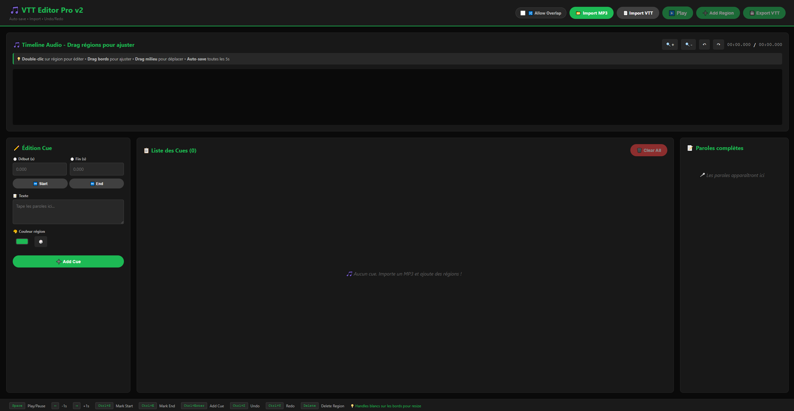

# 🎵 VTT Editor Pro v2

A modern, lightweight, and powerful WebVTT subtitle editor that runs entirely in your browser. No installation, no signup, no cloud dependencies – just one HTML file.



## ✨ Features

### 🎨 **Modern Interface**
- Clean, dark-themed UI designed for extended editing sessions
- Color-coded regions for easy organization
- Real-time waveform visualization
- Responsive timeline with zoom controls

### ⚡ **Powerful Editing**
- **Drag & Drop**: Move and resize regions directly on the timeline
- **Anti-overlap Enforcement**: Optional feature to prevent subtitle collisions
- **Live Preview**: Scrolling lyrics display synchronized with playback
- **Auto-save**: Your work is saved every 5 seconds (localStorage)

### 🎯 **Workflow Optimized**
- Import MP3/audio files directly
- Import/Export WebVTT format
- Keyboard shortcuts for rapid editing
- Precise timestamp control
- Visual waveform for accurate timing

### 🚀 **Technical Highlights**
- **1966 lines** of vanilla JavaScript – no frameworks
- **~200 MB RAM** usage
- **Offline-first**: Works without internet connection
- **Single file**: Just download and open in your browser

## 📦 Installation

**Option 1: Direct Download**
1. Download `vtt-editor-pro-v2.html`
2. Double-click to open in your browser
3. Start editing!

**Option 2: Local Server**
```bash
# Clone the repository
git clone https://github.com/RDTvlokip/vtt-editor-pro.git
cd vtt-editor-pro

# Open with a local server (optional)
python -m http.server 8000
# Navigate to http://localhost:8000
```

## 🎯 Quick Start

1. **Import Audio**: Click `Import MP3` to load your audio file
2. **Add Regions**: Click `Add Region` or use the timeline
3. **Edit Text**: Type your subtitles in the text field
4. **Adjust Timing**: Drag region edges or use Start/End fields
5. **Export**: Click `Export VTT` to save your file

## ⌨️ Keyboard Shortcuts

| Shortcut | Action |
|----------|--------|
| `Space` | Play/Pause |
| `Ctrl+S` | Manual save |
| `-1s` | Jump back 1 second |
| `+1s` | Jump forward 1 second |
| `Ctrl+Z` | Undo |
| `Ctrl+Y` | Redo |
| `Delete` | Delete selected region |

## 🎨 Usage Tips

### Adjusting Regions
- **Move region**: Click & drag the middle
- **Resize region**: Click & drag the edges
- **Double-click**: Edit region in the sidebar

### Color Organization
- Use different colors to organize subtitle types
- Click the color picker in the sidebar
- Colors help visualize structure at a glance

### Anti-overlap Mode
- Toggle "Allow Overlap" to enable/disable
- When disabled, regions automatically adjust to prevent collisions
- Useful for professional subtitle standards

## 🗺️ Roadmap

### v2.1 (Coming Soon)
- [ ] Visual resize handles on regions
- [ ] Snap-to-grid alignment
- [ ] Batch text editing

### v3.0 (Planned)
- [ ] Whisper API integration for auto-transcription
- [ ] FFMPEG.js for video support
- [ ] Multiple subtitle tracks
- [ ] Export to SRT, ASS formats

### Desktop Version (Under Consideration)
- [ ] Electron app with offline Whisper
- [ ] Local model support (tiny/base/small/medium)
- [ ] Native FFMPEG integration

## 🤝 Contributing

Contributions are welcome! This is an early release, and your feedback helps improve the tool.

### How to Contribute
1. Fork the repository
2. Create a feature branch (`git checkout -b feature/AmazingFeature`)
3. Commit your changes (`git commit -m 'Add AmazingFeature'`)
4. Push to the branch (`git push origin feature/AmazingFeature`)
5. Open a Pull Request

### Reporting Issues
Found a bug or have a suggestion? [Open an issue](https://github.com/RDTvlokip/vtt-editor-pro/issues)

## 📄 License

This project is licensed under the Creative Commons Attribution-NonCommercial 4.0 International License (CC BY-NC 4.0) - see the [LICENSE](LICENSE) file for details.

**You are free to:**
- Share and adapt the code for non-commercial purposes
- Give appropriate credit to the original author

**Commercial use requires permission.**

## 🙏 Acknowledgments

- [WaveSurfer.js](https://wavesurfer-js.org/) - Audio waveform visualization
- Inspired by the need for a simple, modern alternative to Aegisub

## 👤 Author

**RDTvlokip (Théo)**
- Creator of [AG-BPE](https://zenodo.org/records/16739553) (Attention-Guided Byte Pair Encoding)
- Developer of InfiniGPT model family
- TSSR Student specializing in Network Administration

## ☕ Support

If VTT Editor Pro helps you, consider [buying me a coffee](https://ko-fi.com/rdtvlokip)!

---

**Built with ❤️ using vanilla JavaScript** | [Report Bug](https://github.com/RDTvlokip/vtt-editor-pro/issues) | [Request Feature](https://github.com/RDTvlokip/vtt-editor-pro/issues)
